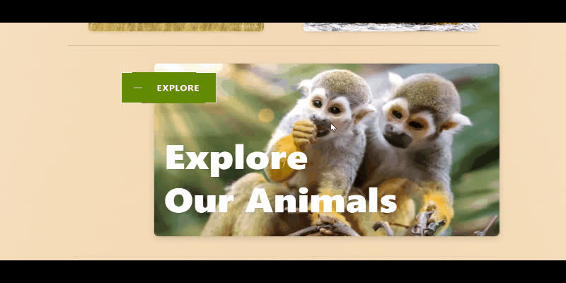
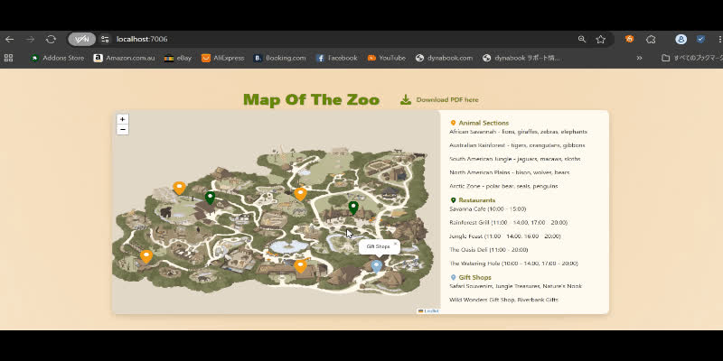
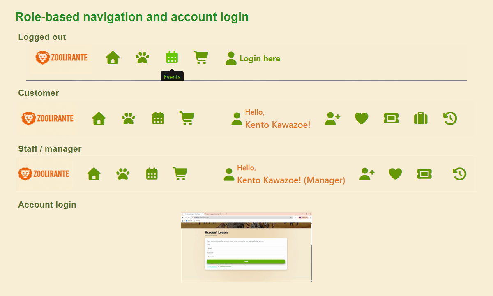
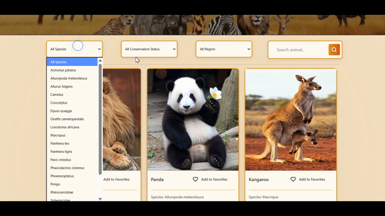
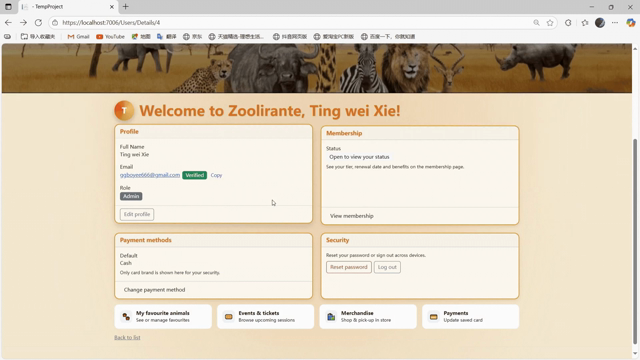
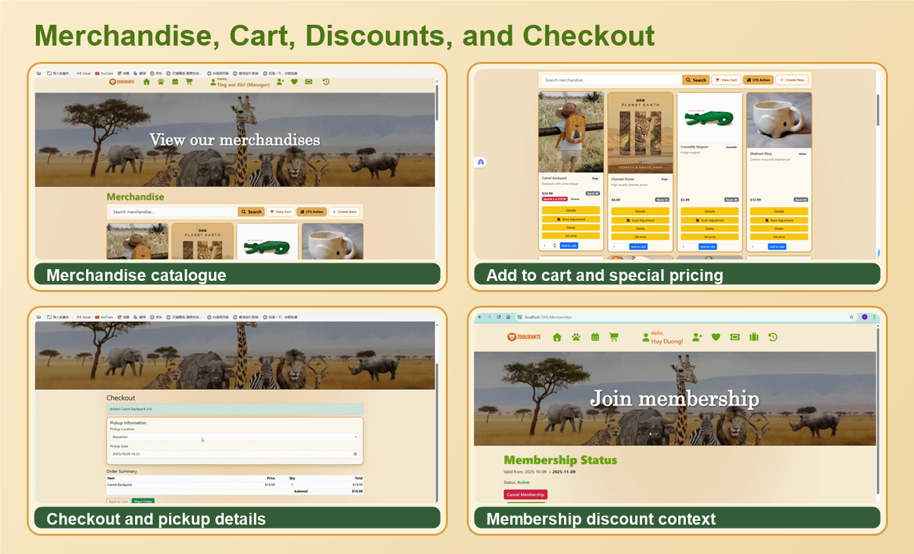
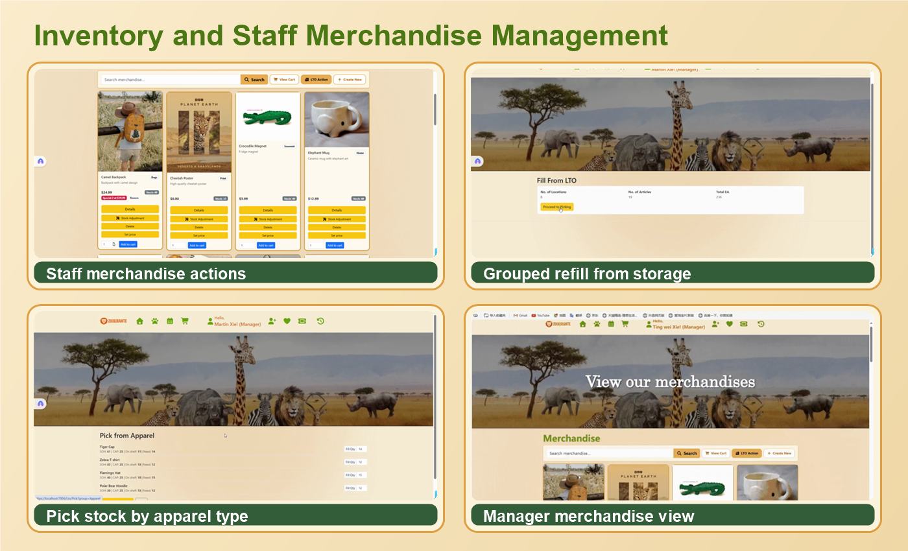
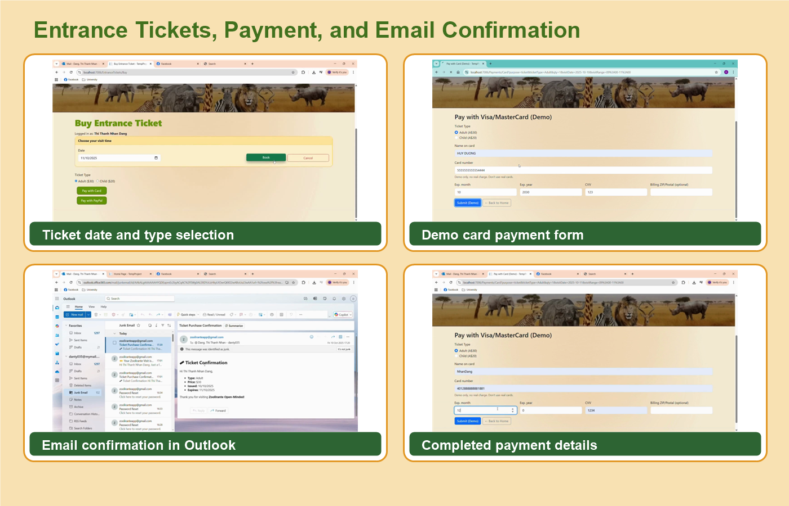
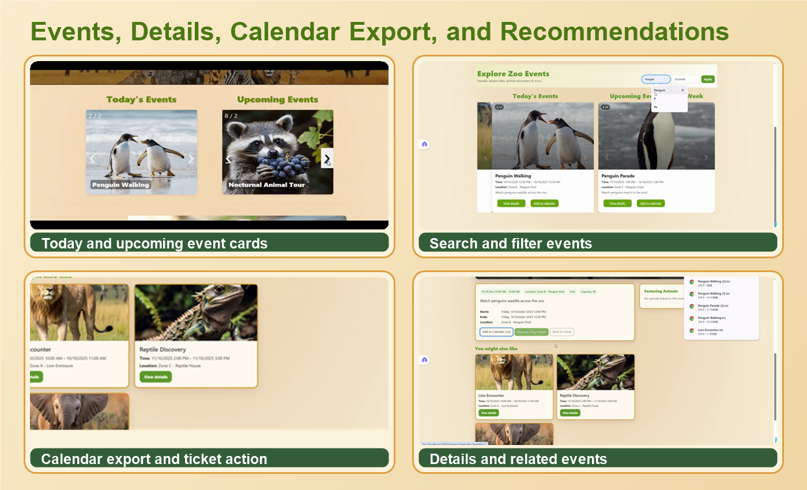

# Zoolirante Open Minded

Zoolirante is a full-stack zoo management web application built in an Agile team environment. The project brings visitor planning, ticket purchasing, animal discovery, merchandise shopping, event browsing, account management, and staff inventory workflows into one practical system.

The website is designed for both visitors and staff. Visitors can explore animals and events, use the interactive map, manage favourites, buy tickets, join membership, purchase merchandise, and receive email confirmations. Staff and managers can access role-specific navigation and manage operational workflows such as merchandise editing, shelf capacity, stock adjustment, refill lists, and event content.

## Tech Stack

- ASP.NET Core MVC
- Entity Framework Core
- SQL Server
- Azure Data Studio
- C#
- LINQ
- HTML, CSS, Bootstrap

## Feature Overview

### Home Page and Interactive Map

The home page gives visitors quick entry points into key zoo areas, including animals, events, membership, and the zoo map. The map includes pins, area details, restaurants, gift shops, and a PDF download option to help visitors plan their visit.

### Role-Based Navigation and Login

The navigation changes based on the user role. Logged-out users see visitor navigation and login access, customers see account-related actions such as favourites, tickets, membership, and history, while managers see staff-level navigation for operational tools.

### Animal Browsing, Search, Filters, and Favourites

Visitors can browse animals with search and filters such as species, conservation status, and region. Animals can also be saved as favourites, which supports later event reminders and personalised visit planning.

### Account, Membership, Payments, and Customer Dashboard

The account dashboard brings profile details, membership status, payment methods, favourite animals, event and ticket information, merchandise shortcuts, and security actions into one place. Membership supports zoo benefits such as discounts and account-based customer features.

### Merchandise, Cart, Discounts, and Checkout

The merchandise module supports product search, item details, cart actions, special pricing, membership discount workflows, pickup information, checkout, and order tracking. This connects the visitor shopping flow with the staff inventory system.

### Inventory and Staff Merchandise Management

Staff-facing screens support merchandise creation, editing, stock adjustment, shelf capacity tracking, grouped refill lists, bulk-to-shelf replenishment, picking from storage, and item management. These workflows were designed to make stock operations easier to track and update.

### Entrance Tickets, Payment, and Email Confirmation

Visitors can buy entrance tickets by selecting a visit date and ticket type, then completing demo card or PayPal-style payment flows. The system sends confirmation emails and can include reminders for upcoming visits and events involving favourite animals.

### Event List, Search, Details, Calendar Export, and Recommendations

The event section supports today's events, upcoming events, search, sorting, event details, calendar export, ticket actions, and related-event recommendations. This helps visitors quickly discover activities and connect events with animal interests.

## My Contribution

I contributed to the merchandise and event workflows, including merchandise search and filtering, cart integration, item management, stock and refill-related features, event list views, event detail pages, related-event recommendations, and calendar export functionality.

I also worked as part of the Agile project team, contributing to feature design, implementation, testing, and final presentation materials.

## Notes

This project was completed as academic project work. The README focuses on the system scope, feature coverage, screenshots, and my practical contribution so recruiters can quickly understand the project.
